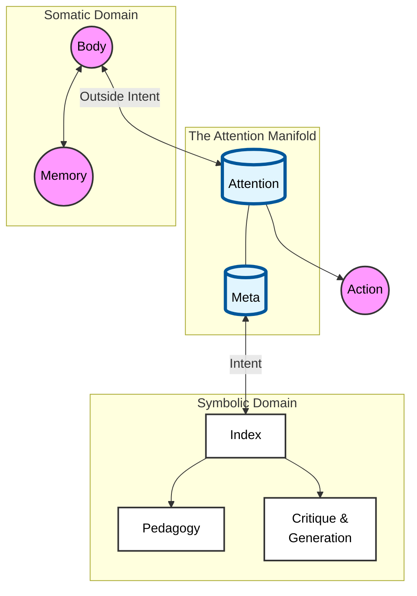

Attention is the frame under which Being, Event and Becoming are realized, so is Pleasure/Pleasure+/Desire Coverage(ie., the valuation)
In an RL sense, it is the frame within which, event/reward/trajectory/policy are interpreted.

Thus, managing attention becomes a schematic problem that needs to be managed in the context of open and closed systems to navigate a multidimensional manifold.

## Architecture of Attention



### ASCII Reference

```text
               Outside Intent            Intent
                    |                      |
      ( Body ) <----+        +-------------+----> [ Index ]
         ^          |        |        (Meta)        |   |
         |          v        v                      |   +--> [ Pedagogy ]
         v      +------------------------+          |
    ( Memory )  |       ATTENTION        |          +------> [ Critique ]
                +-----------+------------+                   [    &     ]
                            |                                [ Generation ]
                            v
                        ( ACTION )
```

## Architecture of the Index: Retrieving "The World"

The Index does not merely select a policy; it retrieves an entire **World**. This World is an emergent container defining the Actor, the Critic, and the specific slice of the Environment that matters.

```mermaid
graph TD
    %% Inputs
    Input([Intent / Meta]) --> Index
    
    subgraph Index [The Index (Library)]
        IndexLogic[Retrieval Mechanism]
    end

    Index -->|Instantiates| ActiveWorld

    subgraph ActiveWorld [The Active World]
        direction TB
        
        %% The Core Loop of the World
        subgraph InternalLoop [Emergent Dynamics]
            Policy[Policy (Actor)<br/><i>The Techne</i>]
            Critic[Valuation (Critic)<br/><i>The Stakes</i>]
            Policy <--> Critic
        end
        
        %% The Filtered Reality
        Env[Effective Environment<br/><i>(The Context)</i>]
        
        Env --> Policy
        Env --> Critic
    end
    
    %% The Real leaking through
    Real((The Real / Somatic)) -.->|Leakage / Noise| Critic
    Real -.->|Raw Input| Env

    %% Outputs
    ActiveWorld --> Pedagogy[Pedagogy]
    ActiveWorld --> Critique[Critique]
    
    %% Styling
    classDef world fill:#e3f2fd,stroke:#1565c0,stroke-width:2px;
    classDef component fill:#ffffff,stroke:#333,stroke-width:1px;
    classDef external fill:#f3e5f5,stroke:#7b1fa2,stroke-width:2px,stroke-dasharray: 5 5;
    
    class ActiveWorld world;
    class Policy,Critic,Env component;
    class Real external;
```

### ASCII Reference (The World)

```text
       ( Intent / Meta )
              |
      [   THE INDEX   ]  <-- Retrieves a specific configuration
              |
              v
   +-------------------------------------------------------+
   |                  THE ACTIVE WORLD                     |
   |        (e.g., World 38: The Bullfighting Ring)        |
   |                                                       |
   |   [ Policy (Actor) ] <-----> [ Valuation (Critic) ]   |
   |     (The Matador)              (Glory vs Death)       |
   |           ^                            ^              |
   |           |                            |              |
   |   [ Effective Env ]            [ The Real / Body ]    |
   |     (The Horns)               (Unpredictable Force)   |
   |           ^                            .              |
   |           |                            .              |
   +-----------|----------------------------.--------------+
               |                            .
      ( Raw Input Data )         ( Somatic Leakage )
```