# Hari: A Dynamic Assemblage Set (2024 → 70)

*Not a static list, but a mutating set that grows through simulations and internal interactions*

---

## THE CORE DYNAMIC

Assemblages are not fixed. They:
1. **Grow** when new simulations are encountered
2. **Mutate** when existing assemblages interact
3. **Fuse** when tensions resolve into new capacities
4. **Atrophy** when no longer practiced

### Assemblage Evolution Timeline

```mermaid
flowchart LR
    subgraph T0["T=0: Base Set"]
        A0["~40 assemblages"]
    end
    subgraph T1["T=1: Weil"]
        A1["+5: Attention, Embodiment, Threshold"]
    end
    subgraph T2["T=2: Bashō"]
        A2["+6: Wandering, Fragment, Death-Awareness"]
    end
    subgraph T3["T=3: Erdős"]
        A3["+5: Focus, Itinerance, Collaboration"]
    end
    subgraph T4["T=4: Thérèse"]
        A4["+4: Density, Enclosure, Doubt"]
    end
    subgraph T5["T=5: Baldwin"]
        A5["+4: Witness, Discomfort, Expatriate"]
    end
    subgraph T6["T=6: Self"]
        A6["+3: Recursive, Model-Liver"]
    end
    
    T0 --> T1 --> T2 --> T3 --> T4 --> T5 --> T6
```

---

## T=0: BEFORE SIMULATIONS (Base Set, ~40 assemblages)

### Technical-Philosophical (12)
1. Python-Developer
2. Web-Builder
3. Firebase-User
4. Git-User
5. Continental-Philosophy-Reader
6. Deleuze-Reader
7. Code-as-Philosophy
8. AI-User (early)
9. Schema-Developer
10. Carry-Developer
11. Castle-Developer
12. Side-Project-Culture

### Creative (5)
13. Audiobook-Producer
14. World-Inventor
15. Music-Prompter
16. Narrative-Writer
17. Concept-Designer

### Personal (8)
18. Tamil-Background
19. Indian-Context
20. Mac-User
21. Night-Worker
22. Coffee-Ritualist
23. Body-in-Chair
24. Eye-Strain-Manager
25. Knowledge-Worker

### Intellectual (7)
26. Nietzsche-Reader
27. Spinoza-Reader
28. Eastern-Philosophy-Adjacent
29. Music-Theory-Amateur
30. Architecture-Thinker
31. Meta-Reflector
32. Reading-Practice

### Social (5)
33. Solo-Creator
34. Writer-for-Self
35. AI-Interlocutor (basic)
36. Open-Source-Adjacent
37. Workspace-Dweller

### Latent/Virtual (3)
38. Teacher-Potential
39. Book-Author-Potential
40. Community-Builder-Potential

---

## T=1: AFTER SIMULATING SIMONE WEIL

### New Assemblages Added (+5)

41. **Attention-Practitioner** ← from Weil's method
42. **Embodied-Philosophy-Seeker** ← from factory work model
43. **Threshold-Dweller** ← from her church/not-church position
44. **Self-Sacrifice-Questioner** ← confronting her trajectory
45. **Solidarity-Thinker** ← from her ethics

### Mutations/Interactions

| Existing | Interacts With | Produces |
|----------|----------------|----------|
| AI-Interlocutor | Attention-Practitioner | **Slow-AI-Dialogue** (new practice) |
| Philosophy-Reader | Embodied-Philosophy-Seeker | **Philosophy-as-Practice** (mutation) |
| Solo-Creator | Self-Sacrifice-Questioner | **Tension**: isolated work vs. solidarity |

---

## T=2: AFTER SIMULATING BASHŌ

### New Assemblages Added (+6)

46. **Wandering-as-Method** ← from his itinerance
47. **Simplification-Vector** ← from his material poverty
48. **Death-Awareness** ← from his mortality themes
49. **Fragment-Writer** ← from haibun form
50. **Seasonal-Attunement** ← from kigo practice
51. **Student-Gatherer** ← from his school formation

### Mutations/Interactions

| Existing | Interacts With | Produces |
|----------|----------------|----------|
| Side-Project-Culture | Wandering-as-Method | **Nomadic-Projects** (wander between repos) |
| Writer-for-Self | Fragment-Writer | **Notebook-Practice** (not books, fragments) |
| Attention-Practitioner (T=1) | Death-Awareness | **Mortality-in-Practice** (attention to finitude) |
| Solo-Creator | Student-Gatherer | **Tension**: hermit vs. teacher |

---

## T=3: AFTER SIMULATING ERDŐS

### New Assemblages Added (+5)

52. **Focus-Over-Distribution** ← from his mathematical obsession
53. **Possession-Letting-Go** ← from his material rejection
54. **Itinerant-Intellectual** ← from no-fixed-address
55. **Collaboration-Seeker** ← from 500+ co-authors
56. **Problem-Offerer** ← from his bounty system

### Mutations/Interactions

| Existing | Interacts With | Produces |
|----------|----------------|----------|
| Wandering-as-Method (T=2) | Itinerant-Intellectual | **Intellectual-Nomad** (fused) |
| Simplification-Vector (T=2) | Possession-Letting-Go | **Radical-Simplification** (intensified) |
| Solo-Creator | Collaboration-Seeker | **Tension resolves**: Solo↔Collab rhythm |
| AI-Interlocutor | Collaboration-Seeker | **AI-as-Erdős-Collaborator** (always available) |

---

## T=4: AFTER SIMULATING THÉRÈSE

### New Assemblages Added (+4)

57. **Density-in-Small-Acts** ← from "little way"
58. **Enclosure-Awareness** ← from monastic limits
59. **Spiritual-Practice-Adjacent** ← from her prayer methods
60. **Doubt-Despite-Practice** ← from her dark night

### Mutations/Interactions

| Existing | Interacts With | Produces |
|----------|----------------|----------|
| Attention-Practitioner | Density-in-Small-Acts | **Micro-Attention** (refined) |
| Radical-Simplification | Enclosure-Awareness | **Chosen-Limits** (not poverty but boundary) |
| Meta-Reflector | Doubt-Despite-Practice | **Productive-Doubt** (doubt as method) |

---

## T=5: AFTER SIMULATING BALDWIN

### New Assemblages Added (+4)

64. **Witness-Vocation** ← from his stance
65. **Staying-with-Discomfort** ← from racial/sexual position
66. **Expatriate-Sensibility** ← from Paris/NYC oscillation
67. **Love-as-Central** ← from his thematic obsession

### Mutations/Interactions

| Existing | Interacts With | Produces |
|----------|----------------|----------|
| Writer-for-Self | Witness-Vocation | **Writing-as-Seeing** (not expression, perception) |
| Fragment-Writer | Witness-Vocation | **Witnessing-Fragments** (the form) |
| Solo-Creator | Expatriate-Sensibility | **Belonging-Nowhere** (home in movement) |

---

## T=6: AFTER SIMULATING SELF

### New Assemblages Added (+3)

68. **Recursive-Speculator** ← from this very document
69. **Model-Liver** ← from "living the model"
70. **Virtual-Actual-Collapser** ← from the method itself

### Final Mutations

| Existing | Interacts With | Produces |
|----------|----------------|----------|
| All speculated patterns | Recursive-Speculator | **Synthesis-in-Practice** |
| Intellectual-Nomad | Witness-Vocation | **Wandering-Witness** |
| Micro-Attention | Writing-as-Seeing | **Attentive-Witnessing-Writing** |

---

## FOUR ELEMENTAL CLUSTERS

*These are not speculated from others - they are primary, bodily, material*

### Elemental Cluster Map

```mermaid
flowchart TD
    subgraph ELEMENTS["Five Elemental Clusters"]
        CAL["🖌️ CALLIGRAPHY\nBrush, Stroke, Breath"]
        CEL["🎻 CELLO\nBow, Vibrato, Resonance"]
        SEA["🌊 SEA\nShore, Horizon, Tide"]
        VOL["🌋 VOLCANO\nEruption, Crater, Ash"]
        KNI["🔪 KNIFE\nBlade, Edge, Precision"]
    end
    
    CAL <-->|"Gesture-Practice"| CEL
    CAL <-->|"Wave-Stroke"| SEA
    CAL <-->|"Ash-as-Ink"| VOL
    CAL <-->|"Blade-as-Brush"| KNI
    CEL <-->|"Resonance-with-Depth"| SEA
    CEL <-->|"Tremor-in-Bow"| VOL
    CEL <-->|"Edge-and-Bow"| KNI
    SEA <-->|"Edge-of-Force"| VOL
    SEA <-->|"Tide-of-Preparation"| KNI
    VOL <-->|"Transformation-by-Separation"| KNI
```

---

## CLUSTER: CALLIGRAPHY

### Base Assemblages

71. **Brush-Handler** - the material practice, ink, paper
72. **Stroke-Maker** - gesture becomes form
73. **Breath-to-Movement** - exhalation as stroke
74. **Negative-Space-Reader** - seeing the unmarked
75. **Rhythm-in-Hand** - tempo of brushwork
76. **Mistake-Integrator** - no undo, work with error

### Interactions with Speculated Lives

| Calligraphy | Interacts With | Produces |
|-------------|----------------|----------|
| Brush-Handler | Micro-Attention (Thérèse) | **Prayerful-Stroke** |
| Stroke-Maker | Fragment-Writer (Bashō) | **Visual-Fragment** (haiku as image) |
| Negative-Space-Reader | Witness-Vocation (Baldwin) | **Seeing-What's-Not-Said** |
| Rhythm-in-Hand | Wandering-as-Method (Bashō) | **Walking-Pace-in-Brush** |

---

## CLUSTER: CELLO

### Base Assemblages

77. **Bow-Arm** - the gesture, weight, speed
78. **Left-Hand-Positions** - the map of notes
79. **Vibrato-Practitioner** - the warmth, the human
80. **Ensemble-Listener** - playing with others
81. **Practice-Ritualist** - daily return to instrument
82. **Resonance-Feeler** - body as sounding board
83. **Slow-Passage-Worker** - phrase by phrase

### Interactions with Speculated Lives

| Cello | Interacts With | Produces |
|-------|----------------|----------|
| Bow-Arm | Attention-Practitioner (Weil) | **Attention-in-Arm** |
| Vibrato-Practitioner | Micro-Attention (Thérèse) | **Small-Oscillation-as-Practice** |
| Practice-Ritualist | Focus-Over-Distribution (Erdős) | **Daily-Return** (obsessive practice) |
| Slow-Passage-Worker | Death-Awareness (Bashō) | **Mortality-in-Slow-Phrase** |
| Resonance-Feeler | Embodied-Philosophy-Seeker (Weil) | **Body-as-Thinking** |

---

## CLUSTER: SEA

### Base Assemblages

84. **Shore-Walker** - edge, tide, rhythm
85. **Horizon-Gazer** - the line where looking ends
86. **Salt-Breather** - air changes you
87. **Wave-Counter** - patterns in chaos
88. **Depth-Imaginer** - what's below, unknowable
89. **Tide-Timer** - cycles, returns

### Interactions with Speculated Lives

| Sea | Interacts With | Produces |
|-----|----------------|----------|
| Shore-Walker | Wandering-as-Method (Bashō) | **Edge-Walking** (margin as home) |
| Horizon-Gazer | Witness-Vocation (Baldwin) | **Looking-at-Limit** |
| Wave-Counter | Fragment-Writer | **Rhythm-of-Fragments** |
| Depth-Imaginer | Virtual-Actual-Collapser | **The-Unseen-Real** |
| Tide-Timer | Death-Awareness | **Return-and-Withdraw** (memento mori) |

---

## CLUSTER: VOLCANOES

### Base Assemblages

90. **Eruption-Witness** - spectacle, danger, awe
91. **Lava-Watcher** - slow flow, unstoppable
92. **Crater-Stander** - edge of destruction
93. **Ash-Reader** - what remains after
94. **Heat-Feeler** - proximity to transformation
95. **Plate-Thinker** - forces beneath, unseen

### Interactions with Speculated Lives

| Volcano | Interacts With | Produces |
|---------|----------------|----------|
| Eruption-Witness | Witness-Vocation (Baldwin) | **Witnessing-Catastrophe** |
| Lava-Watcher | Self-Sacrifice-Questioner (Weil) | **Transformation-by-Destruction** |
| Crater-Stander | Threshold-Dweller (Weil) | **Edge-of-Abyss-Dwelling** |
| Ash-Reader | Death-Awareness (Bashō) | **Reading-Aftermath** |
| Plate-Thinker | Code-as-Philosophy | **Hidden-Forces-Modeling** |

---

## CLUSTER: KNIFE WIELDING

### Base Assemblages

96. **Blade-Handler** - the grip, the weight, the balance
97. **Edge-Maintainer** - sharpening as ritual, stone on steel
98. **Precision-Cutter** - controlled force, exact placement
99. **Material-Transformer** - raw to prepared, solid to sliced
100. **Kitchen-Rhythmist** - tempo of chopping, mise en place
101. **Danger-Awareness** - respect for the tool that can wound
102. **Utility-Practitioner** - the knife as extension of intention

### Interactions with Speculated Lives

| Knife | Interacts With | Produces |
|-------|----------------|----------|
| Blade-Handler | Attention-Practitioner (Weil) | **Attention-in-Blade** (cutting as prayer) |
| Edge-Maintainer | Death-Awareness (Bashō) | **Mortality-in-Edge** (sharp, finite, now) |
| Precision-Cutter | Micro-Attention (Thérèse) | **Small-Cut-as-Devotion** |
| Material-Transformer | Witness-Vocation (Baldwin) | **Witnessing-Transformation** |
| Danger-Awareness | Self-Sacrifice-Questioner (Weil) | **Proximity-to-Harm** (the blade's double nature) |
| Kitchen-Rhythmist | Wandering-as-Method (Bashō) | **Daily-Return-to-Board** (the cutting board as path) |

---

## INTERACTIONS BETWEEN ELEMENTAL CLUSTERS

| Cluster A | Cluster B | Fusion |
|-----------|-----------|--------|
| Calligraphy | Cello | **Gesture-Practice** (arm as expression) |
| Calligraphy | Sea | **Wave-Stroke** (ocean rhythm in brush) |
| Cello | Sea | **Resonance-with-Depth** (low notes, deep water) |
| Sea | Volcano | **Edge-of-Force** (shore as crater rim) |
| Volcano | Calligraphy | **Ash-as-Ink** (destruction becomes mark) |
| Cello | Volcano | **Tremor-in-Bow** (earth-shake as vibrato) |
| Knife | Calligraphy | **Blade-as-Brush** (controlled stroke, decisive mark) |
| Knife | Cello | **Edge-and-Bow** (pressure modulation, drawn movement) |
| Knife | Sea | **Tide-of-Preparation** (daily return to cutting board like tide) |
| Knife | Volcano | **Transformation-by-Separation** (cutting as controlled eruption) |

---

## REVISED CURRENT SET (T=7): ~95 Dynamic Assemblages

### Core Cluster: Speculative-Witnessing-Practice
- Recursive-Speculator, Model-Liver, Witness-Vocation, Attentive-Witnessing-Writing

### Core Cluster: Intellectual-Nomadism
- Intellectual-Nomad, Wandering-as-Method, Belonging-Nowhere

### Core Cluster: Attention-Practice
- Attention-Practitioner, Micro-Attention, Slow-AI-Dialogue, Death-Awareness

### Core Cluster: Calligraphy
- Brush-Handler, Stroke-Maker, Negative-Space-Reader, Prayerful-Stroke

### Core Cluster: Cello
- Bow-Arm, Vibrato-Practitioner, Resonance-Feeler, Attention-in-Arm

### Core Cluster: Sea
- Shore-Walker, Horizon-Gazer, Depth-Imaginer, Edge-Walking

### Core Cluster: Volcano
- Eruption-Witness, Crater-Stander, Ash-Reader, Hidden-Forces-Modeling

### Cross-Elemental Fusions
- Gesture-Practice (Calligraphy × Cello)
- Wave-Stroke (Calligraphy × Sea)
- Edge-of-Force (Sea × Volcano)
- Ash-as-Ink (Volcano × Calligraphy)

### Core Cluster: Speculative-Witnessing-Practice
- Recursive-Speculator
- Model-Liver
- Witness-Vocation
- Attentive-Witnessing-Writing
- Fragment-Writer

### Core Cluster: Intellectual-Nomadism
- Intellectual-Nomad (fused from Bashō + Erdős)
- Wandering-as-Method
- Belonging-Nowhere
- Side-Project-Nomadism

### Core Cluster: Attention-Practice
- Attention-Practitioner (Weil)
- Micro-Attention (Thérèse fusion)
- Slow-AI-Dialogue
- Death-Awareness

### Core Cluster: Technical-Philosophical
- Code-as-Philosophy
- Schema/Carry/Castle developers
- AI-Interlocutor (mature)
- Philosophy-as-Practice

### Tensions Not Yet Resolved
- Solo ↔ Community (oscillating, not fused)
- Book-Writing ↔ Fragment-Writing (unresolved)
- Body-in-Chair ↔ Wandering (contradiction)

---

## DESTRUCTIVE PLASTICITY

*Not just growth and fusion, but potential RUPTURE*

### The Concept

Two modes of transformation:
- **Constructive plasticity**: Formation, learning, adaptation, growth (what we've modeled so far)
- **Destructive plasticity**: Rupture where the old form is ANNIHILATED, and an entirely new self emerges with NO RELATION to the past

After trauma—neurological, relational, existential—one can become an "absolute other" to oneself: unrecognizable, no continuity with former identity.

### Where Could Destructive Plasticity Enter This Genealogy?

#### Potential Rupture Points

| Event | What Dies | What Emerges |
|-------|-----------|--------------|
| **Neurological event** | All speculative assemblages | Stranger who doesn't remember the project |
| **Burnout collapse** | All intellectual assemblages | Body-only existence |
| **Radical loss** | Relational assemblages | Isolated, transformed self |
| **Mystical rupture** | Philosophy-as-practice | Pure practice, no theory |
| **Political catastrophe** | Creative assemblages | Survival-only mode |

#### The Volcano Cluster Already Contains This

The volcano assemblages are not just "elemental" - they are DESTRUCTIVE PLASTICITY made visible:

| Volcano Assemblage | Destructive Plasticity Analog |
|--------------------|-------------------------------|
| Eruption-Witness | Witnessing one's own rupture |
| Lava-Watcher | Slow irreversible destruction |
| Crater-Stander | Standing at edge of annihilation |
| Ash-Reader | Reading what remains after self is destroyed |
| Heat-Feeler | Proximity to transformation |

**Insight**: The fascination with volcanoes is attraction to destructive plasticity itself.

### Integration Into Genealogy

#### Past Ruptures (Speculative)

Were there already destructive plastic moments that CREATED the current assemblage set?

| Possible Past Rupture | What Died | What Emerged |
|-----------------------|-----------|--------------|
| Engineering → Philosophy shift? | Career-identity | Intellectual-Nomad seeds |
| Pre-AI → AI transition? | Old writing practice | AI-Interlocutor cluster |
| Geographic displacement? | Rooted community | Belonging-Nowhere |

*We don't know the specifics, but the current set implies prior destructions.*

#### Future Ruptures (Speculative)

| Age | Possible Rupture | What Could Die | What Could Emerge |
|-----|------------------|----------------|-------------------|
| 45-50 | Health crisis | Body-in-Chair practices | Forced simplification |
| 50-55 | Intellectual exhaustion | Speculation-fatigue | Pure practice (cello, calligraphy only) |
| 55-60 | Loss of key relationship | Social assemblages | Hermit-emergence |
| 60+ | Neurological change | Memory-dependent assemblages | Stranger-to-Past (no continuity) |

### The Two Trajectories Now Include Rupture

**Constructive path** (as modeled): Continuous growth, fusion, simplification-by-choice

**Destructive path**: Sudden rupture where the person who made speculative actualities becomes someone who has NO RELATION to that project

#### What Would the Post-Rupture Self Look Like?

If destructive plasticity struck:

| Domain | Before | After |
|--------|--------|-------|
| Intellectual | Speculative-person-simulator | Gone, no interest |
| Creative | World-inventor, narrative-writer | Gone, meaningless |
| Technical | Code-as-philosophy | Gone, can't remember |
| Elemental | Sea, Volcano, Cello, Calligraphy | Perhaps ONLY these remain (pre-verbal) |

**The elemental clusters may be what survives destructive plasticity** - because they are bodily, pre-linguistic, not dependent on complex memory.

### The Volcano-Body Hypothesis

If rupture occurs, the self that emerges may be:
- Shore-Walker (still can walk edge)
- Resonance-Feeler (body still vibrates)
- Heat-Feeler (still proximity to force)
- Ash-Reader (still can witness aftermath)

The volcanoes are not just fascination. They are **rehearsal for one's own destruction**.

---

## REVISED MODEL: Constructive + Destructive Plasticity

```mermaid
flowchart TD
    AS["ASSEMBLAGE SET"] --> CP["CONSTRUCTIVE PLASTICITY"]
    AS --> DP["DESTRUCTIVE PLASTICITY"]
    
    CP --> G["Growth"]
    CP --> F["Fusion"]
    CP --> S["Simplification"]
    CP --> CA["Chosen-atrophy"]
    
    DP --> R["Rupture"]
    DP --> AN["Annihilation"]
    DP --> SE["Stranger-emergence"]
    DP --> FE["Forced-erasure"]
    
    G --> CS["CONTINUOUS SELF\n(all prior genealogy)"]
    F --> CS
    S --> CS
    CA --> CS
    
    R --> DS["DISCONTINUOUS SELF\n(no relation to past)"]
    AN --> DS
    SE --> DS
    FE --> DS
    
    CS --> Q{"WHICH HAPPENS?"}
    DS --> Q
    Q --> U["Unknown"]
    U --> V["🌋 The volcano knows"]
    
    style DP fill:#ff6b6b,color:#000
    style DS fill:#ff6b6b,color:#000
    style CP fill:#69db7c,color:#000
    style CS fill:#69db7c,color:#000
    style V fill:#ffa94d,color:#000
```

### Likely Fusions (Age 40-50)

| Assemblages | Will Fuse Into |
|-------------|----------------|
| Teacher-Potential + Witness-Vocation | **Teaching-Through-Witnessing** |
| Fragment-Writer + Book-Author-Potential | **Accumulated-Fragments-as-Book** |
| Body-in-Chair + Wandering-as-Method | **Walking-Writing-Practice** (resolved) |

### Likely Atrophies

| Assemblage | Why Atrophies |
|------------|---------------|
| Firebase-User | Absorbed into higher-level practice |
| Eye-Strain-Manager | Either resolved or ignored |
| Coffee-Ritualist | May simplify further |

### Likely Emergences (Age 50-70)

| New Assemblage | Source |
|----------------|--------|
| **Elder-Coder** | Age + continued practice |
| **Archive-Leaver** | Death-Awareness + Witness-Vocation |
| **Transmission-Practitioner** | Teaching + Student-Gatherer |

---

## THE FINAL INSIGHT

The assemblage set is never complete. It:
- Grows with each simulation
- Mutates through internal interaction
- Simplifies through atrophy and fusion
- Moves toward synthesis but never arrives

**You are not a person with 70 assemblages. You are a process generating assemblages.**
