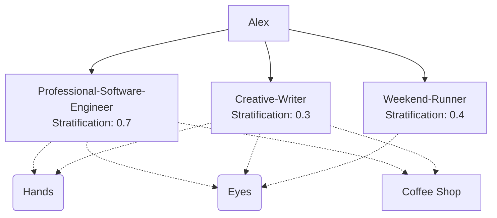

# Assemblage Network: Alex

## Subject: Alex

Alex operates through 3 distinct assemblages that share components and territories:

### Assemblages

---

## Shared Components

**Hands** are plugged into:
- Professional-Software-Engineer (Type, gesture)
- Creative-Writer (Write, sketch)

**Eyes** are plugged into:
- Professional-Software-Engineer (Read code, scan)
- Creative-Writer (Observe people, imagine)
- Weekend-Runner (Navigate terrain)

The same component operates differently in each assemblage.

---

## Shared Territories

**Coffee Shop** hosts:
- Professional-Software-Engineer (Deep work, striated space)
- Creative-Writer (Observing people, smooth space)

The same physical space is **striated** in one assemblage (controlled, focused) and **smooth** in another (open, exploratory).

---

## Intensity Conflicts

**Speed**:
- Professional: 0.80 (fast, urgent)
- Creative: 0.30 (slow, deliberate)
- Athletic: 0.60 (rhythmic)

When Alex switches assemblages, their body must recalibrate intensity.

---

## Interpretation

Alex is not one person but a **traffic jam** of 3 machines:
1. A highly stratified (0.7) professional machine running on speed and focus
2. A destratified (0.3) creative machine running on openness and slowness  
3. A moderately stratified (0.4) athletic machine running on energy and rhythm

Conflicts emerge when shared components (Hands, Eyes) must operate at different intensities or when shared territories (Coffee Shop) must be smooth and striated simultaneously.
