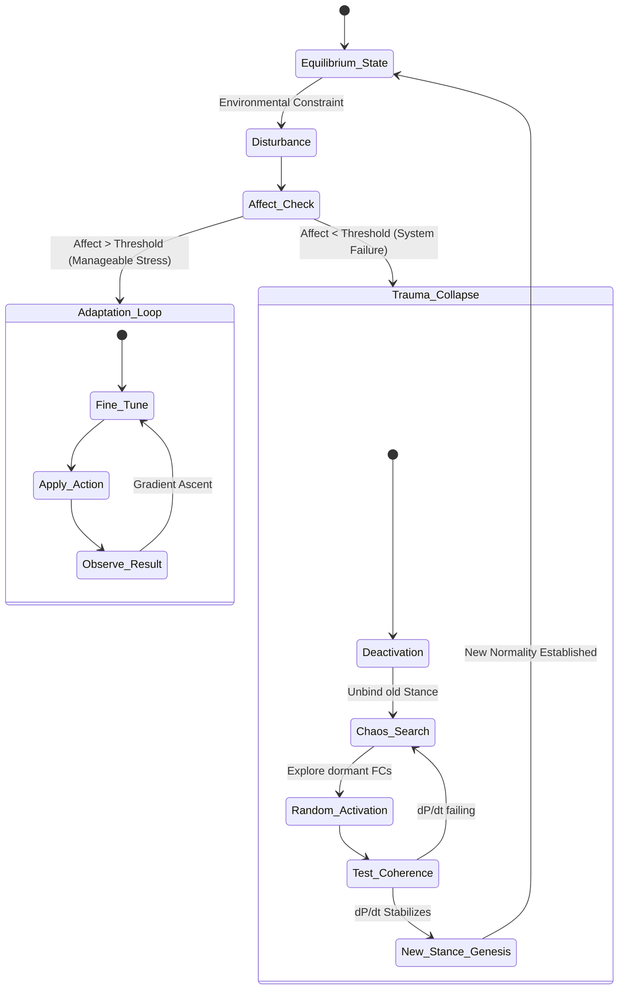
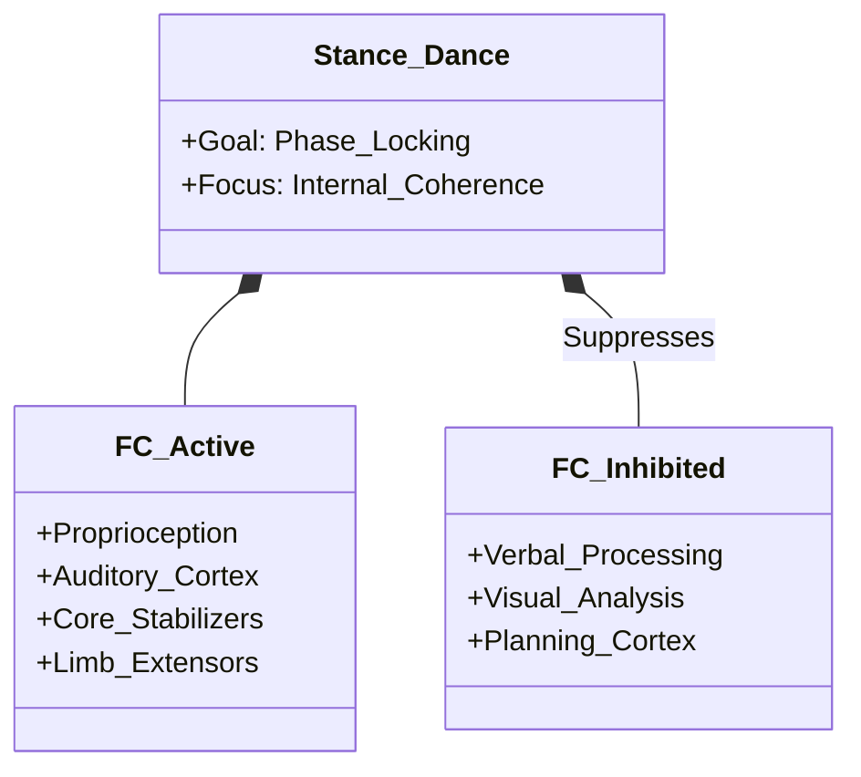
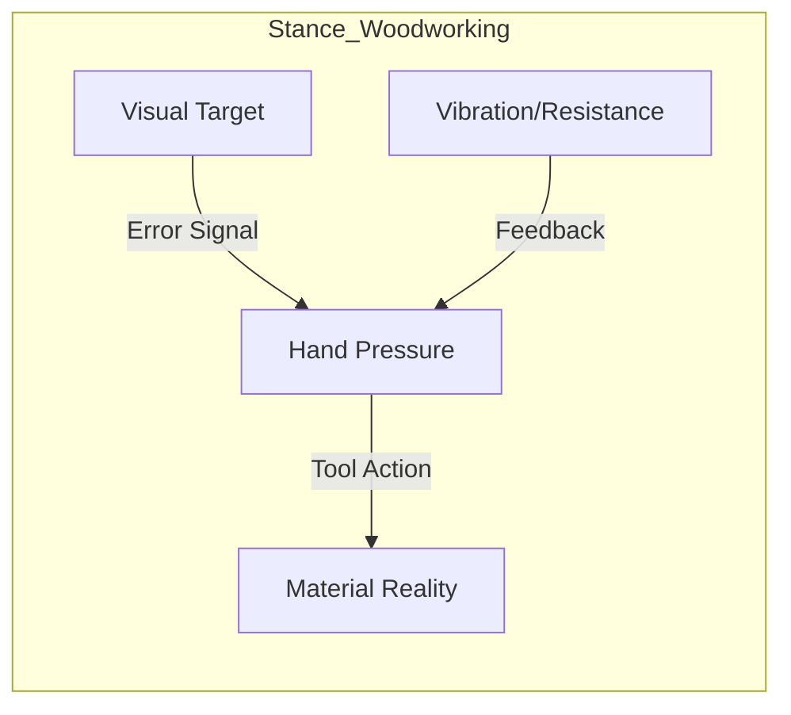
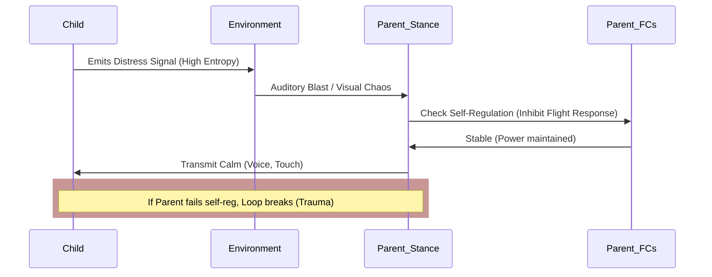

Here is the formalization of the "Conatus Architecture" using mathematical notation (borrowing from set theory, control theory, and dynamic systems) and Mermaid diagrams to visualize the structural flow.

### I. Formal Mathematical Formulation

We model the agent as a system striving to maximize its **Power of Acting (P)** within an Environment (E).

#### 1. Core Definitions

* **Functional Components (FC):** The set of all available atomic capabilities.


*(e.g., f_{grasp}, f_{visual\_cortex}, f_{memory})*
* **Stance (S):** A weighting vector (or mask) applied to FC at time t. It defines which components are active, inhibited, or amplified.


Where \mathbf{w} = [w_1, w_2, ..., w_n]^T and w_i \in [-1, 1] (where -1 is active inhibition, 1 is full activation).
* **Encounter Frame (E):** The state of the environment, offering specific affordances (A_{ff}) and constraints (C).


* **Observation (O) & Action (A):**


 (The Stance processes the observation to produce action).

#### 2. The Affective Engine (The Conatus)

We define **Affect (\mathcal{A})** not as a static reward, but as the derivative of the agent's Power of Acting (P).

* **Power (P):** A measure of the agent's coherence and control over E.
* **Affect (\mathcal{A}):**


* If \frac{dP}{dt} > 0: **Joy** (Stance is working; reinforce).
* If \frac{dP}{dt} < 0: **Sadness** (Stance is failing; warn).
* If \frac{dP}{dt} \ll -\delta (Critical Threshold): **Trauma** (Stance collapse).


#### 3. Learning vs. Novelty Search (The Trauma Switch)

This defines the transition between "Practice" (Adoption) and "Crisis Discovery" (Novelty Search). We define a mode switching function M(t):

* **Mode A: Refine (Gradient Ascent):**
Standard learning. We adjust the weights \mathbf{w} of the current stance S_k to maximize \mathcal{A}.


* **Mode B: Novelty Search (Topological Reconfiguration):**
The current local maximum is a trap/failure. We discard S_k and sample a new Stance topology from the space of components.


*Where \sigma is a selection function looking for immediate stabilization of \frac{dP}{dt}.*

---

### II. Mermaid System Diagrams

#### 1. The High-Level Architecture

This diagram illustrates the core loop: Observation \to Stance \to Action, modulated by the Affective Engine.

```mermaid
graph TD
    subgraph Environment
    E[Reality / Encounter Frame] -->|Provides| O[Observation]
    E -->|Feedback| P_External[Result/Outcome]
    end

    subgraph Agent_Internal
    O --> S{Current Stance S_k}
    S -->|Activates| FC[Functional Components]
    S -->|Inhibits| IFC[Inhibited Components]
    FC --> A[Action]

    %% The Affective Loop
    P_External -.->|Evaluates| ARC[Affect Register Complex]
    ARC -->|dP/dt > 0 (Joy)| R[Refine / Stabilize]
    ARC -->|dP/dt < Threshold (Trauma)| NS[Trigger Novelty Search]

    R -.->|Update Weights| S
    NS -.->|Construct New S| S
    end

    A -->|Impacts| E

```

#### 2. The "Trauma" Novelty Search Logic

This state machine details exactly how the system handles the "adversarial" environment design or trauma response.



---

### III. Specific Stance Modeling

Here is how the formal definitions apply to your specific examples.

#### Example A: The Dancer (Improvisation)

* **Math Form:** Coupled Oscillator Model.
The goal is phase-locking internal proprioception (\phi_{body}) with external auditory rhythm (\phi_{audio}).


* **Trauma Trigger:** Complete loss of rhythm (trip/fall).
* **Novelty Search:** "I cannot step; I must roll." (Discovering floor-work).




#### Example B: The Woodworker (Precision)

* **Math Form:** Error Minimization (PID Control).
The goal is to minimize the delta between the *Ideal Geometry* (G_{target}) and *Current Material State* (G_{mat}).


* **Trauma Trigger:** Tool breakage or ruining the wood (irreversible error).
* **Novelty Search:** "The chisel is dull; I must use a scraping motion instead of cutting."




#### Example C: Child Rearing (Co-Regulation)

* **Math Form:** Homeostatic Coupling.
The Agent (Ag) tries to minimize the entropy (H) of the Child's (Ch) state.


Constraint: Agent must maintain their own stability (State_{Ag}).
If State_{Ag} destabilizes (parent panics), H(State_{Ch}) increases (child panics more).

