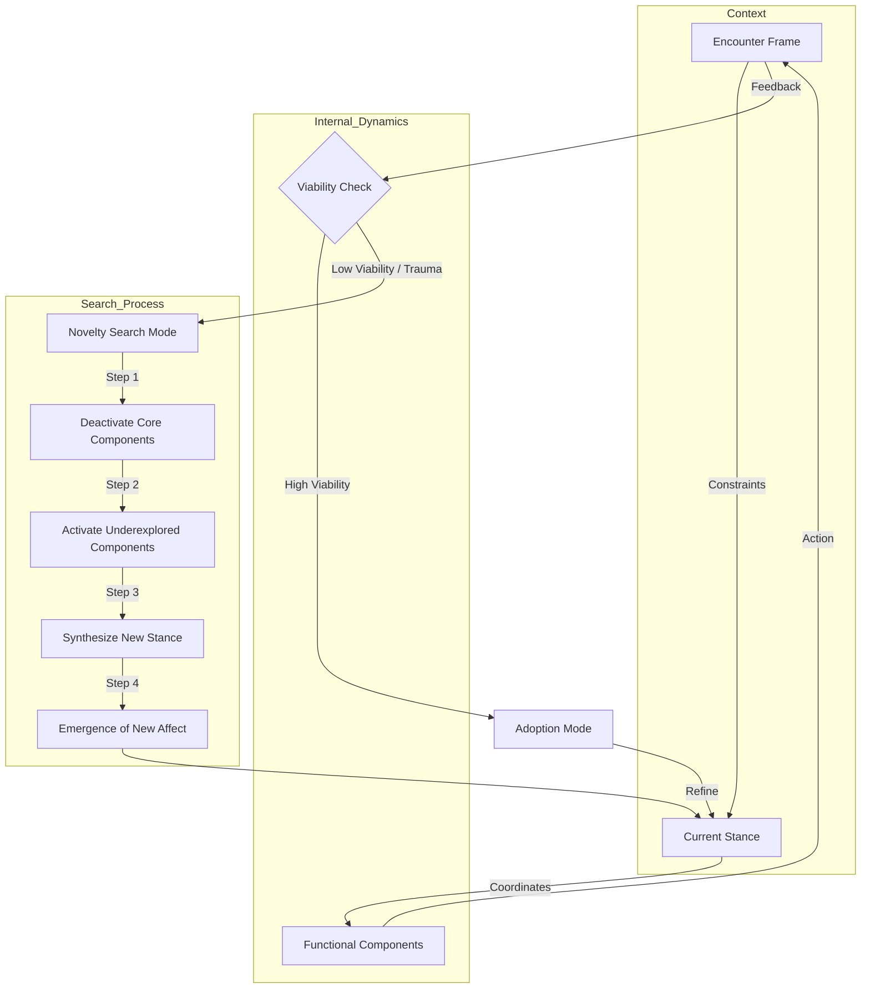

Understood. I will strip out the "Conatus/Spinoza" interpretation and stick strictly to the mechanics we discussed: the interaction between **Functional Components** and **Higher Order Complexes (Stances)**, the specific dynamics of **Adoption vs. Novelty Search**, and the role of **Affect Registers** and **Encounter Frames**.

Here is the revised summary and formalization of the **Dynamic Stance-Component Architecture**.

### 1. Architectural Summary

This system models an agent as a collection of modular capabilities that are dynamically organized into temporary hierarchies to meet environmental constraints.

#### A. The Structural Elements

1. **Functional Components (FC):** The atomic units of capability (motor, sensory, cognitive). These are the raw resources available to the system.
2. **The Stance (Higher Order Complex):** A specific configuration or "binding" of Functional Components. A Stance determines which FCs are active, which are inhibited, and how they coordinate.
3. **Encounter Frame:** The specific slice of the environment (constraints and variables) the agent is currently interacting with.
4. **Affect Registers:** The internal signaling system that indicates the viability of the current Stance. Note: New affect registers can emerge as new Stances are discovered.

#### B. The Two Dynamic Modes

1. **Mode 1: Adoption (Optimization):**
* *Trigger:* The current Stance effectively handles the Encounter Frame.
* *Process:* The system refines the coordination of the currently active FCs.
* *Result:* Increased efficiency; familiar affect registers.

2. **Mode 2: Novelty Search (Trauma/Discovery):**
* *Trigger:* The Encounter Frame presents a constraint the current Stance cannot solve (Stance Failure).
* *Process:*
* **Deactivation:** Core components of the old Stance are forcibly suppressed.
* **Exploration:** The system activates underexplored or dormant FCs.
* **Re-binding:** A new Higher Order Complex is tested.

* *Result:* Emergence of a **New Stance** and potentially **New Affect Registers**.

---

### 2. Formal Mathematical Formulation

#### The Definitions

* Let FC = \{f_1, f_2, ..., f_n\} be the set of all Functional Components.
* Let E_t be the Encounter Frame at time t (the environment state).
* Let S be a **Stance** (Higher Order Complex), defined as a mapping function that applies weights w to components:

*(Where w_i determines if a component is Active, Inhibited, or Neutral).*

#### The Feedback Function (Viability)

Let V(S, E_t) be the viability (success) of Stance S in Encounter E_t.

* If V > \text{Threshold}: The system enters **Adoption Mode**.
* If V < \text{Threshold}: The system enters **Novelty Search Mode**.

#### The Discovery Mechanism (Trauma/Search)

When V drops below the critical threshold (Trauma), the system updates S not by gradient descent, but by topological reconfiguration:

1. **Inhibit Core:** Identify set C \subset FC (core components of failed stance) and set w_c \to 0.
2. **Activate Dormant:** Identify set D \subset FC (underexplored components) and set w_d \to 1.
3. **Emergence:**

*(A new affect register is created to mark the specific sensation of this new coordination).*

---

### 3. Visualizations

#### High-Level Logic Flow

---

### 4. Specific Stance Illustrations

Here is how specific activities map to this constrained architecture.

#### Illustration A: Dance (Improvisational Discovery)

* **Context:** The dancer is physically stuck or off-balance (Encounter Frame constraint).
* **Functional Components:**
* *Core (Old Stance):* Vertical spine alignment, visual spotting, foot placement.
* *Underexplored:* Shoulder blades, floor contact with knees, peripheral vision.

* **The Shift (Trauma/Search):**
1. The "Vertical Stance" fails (loss of balance).
2. **Deactivation:** System inhibits the urge to "right" the spine vertically.
3. **Discovery:** System activates "floor contact with knees."
4. **New Stance:** "Floor-work / Rolling Stance."
5. **New Affect Register:** A specific sensation of "grounded fluidity" (distinct from the "upright poise" register).

#### Illustration B: Woodworking (Adversarial Environment)

* **Context:** The wood grain is wild and tears when planed normally (Adversarial Encounter).
* **Functional Components:**
* *Core (Old Stance):* Forward arm thrust, tight grip, visual focus on line.
* *Underexplored:* Skewing angle of tool, listening to cutting sound, wrist rotation.

* **The Shift:**
1. "Standard Planing" fails (wood tears).
2. **Deactivation:** Stop the forward thrusting momentum.
3. **Discovery:** Activate "skew angle" and "high-sensitivity tactile feedback."
4. **New Stance:** "Shearing Cut Stance."
5. **New Affect Register:** The specific feeling of "slicing" (distinct from "pushing").

#### Illustration C: Child Rearing (Hierarchical Stance)

* **Context:** A child is having a tantrum; logical reasoning is failing.
* **Functional Components:**
* *Core (Old Stance):* Verbal logic, standing posture, authoritative tone.
* *Underexplored:* Rhythmic patting, humming, sitting on floor.

* **The Shift:**
1. "Authoritative/Logical Stance" fails (crying increases).
2. **Deactivation:** Inhibit verbal centers and "teaching" drive.
3. **Discovery:** Activate non-verbal rhythm and lowers center of gravity.
4. **New Stance:** "Co-Regulating Stance" (A Meta-Stance governing physical closeness).
5. **New Affect Register:** A feeling of "shared resonance" (distinct from "control").

### Summary of Final Architecture

This model replaces the idea of "reward" with **Stance Viability**. It posits that growth happens not just through improvement (Adoption) but through the **traumatic breaking of old forms** to force the coordination of previously unrelated Functional Components (Novelty Search), resulting in both new behaviors and new ways of feeling (Affect Registers).